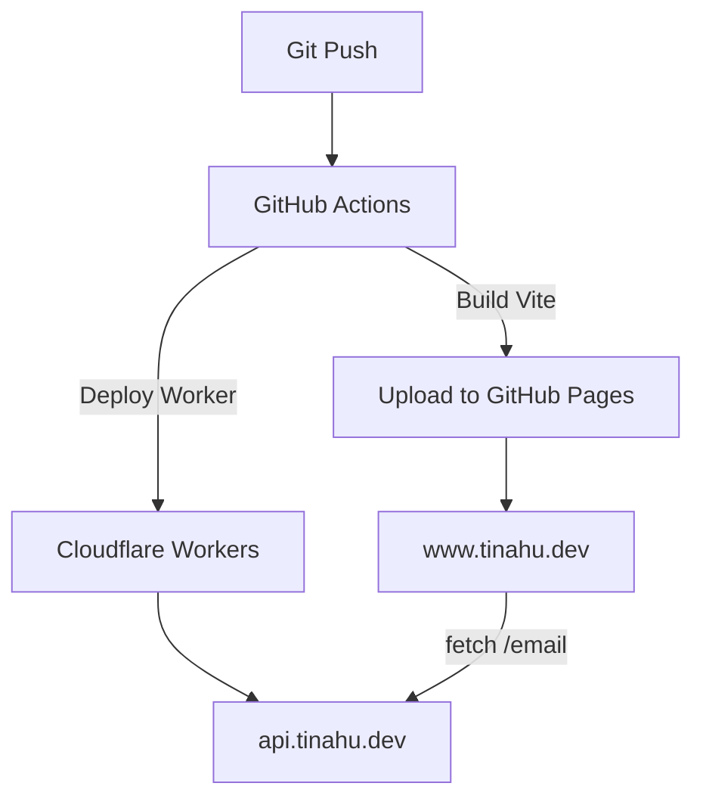

# 🌟 Tina Hu ｜ Frontend Engineer

> 熱衷以 React + TypeScript 打造可維護、高效能的使用者體驗。  
> 目前專注於前端工程化、系統化設計與前後端整合開發。

**Tech Stack:** React · TypeScript · Next.js · Node.js · Tailwind CSS · Cloudflare Workers

---

## Portfolio 主站

[https://www.tinahu.dev](https://www.tinahu.dev)

---

## 專案作品

### 🎓 MERN Stack 全端課程平台

> 展示完整前後端整合、登入驗證與角色權限設計能力。

**技術棧**：MongoDB、Express、React、Node.js、TypeScript、Recoil、Joi、JWT  
**部署**：Vercel（前端）＋ Render（後端）

**挑戰與解法**

- 實作 **JWT 登入 + RBAC 角色權限管理**
- 以 **Joi Schema 驗證** 抽象表單邏輯 → 模組化可重用
- 使用 **Recoil 管理全域登入狀態**
- 後端設計 **課程 CRUD / 使用者角色分流 API**

**成果**

- Instructor / Student 雙角色登入串接成功
- API 錯誤集中處理、提高除錯效率
- 專案結構模組化，可快速擴展

🔗 [Demo](https://course.tinahu.dev/) ｜ 💻 [Code](https://github.com/yuting813/mern-project)

---

### 🎬 Netflix Clone

> 以 Next.js + Firebase 模擬串流平台體驗，重現完整 UI 與訂閱流程。

**技術棧**：Next.js 13、TypeScript、Tailwind CSS、Firebase、Stripe、Recoil  
**部署**：Vercel + Firebase Hosting

**挑戰與解法**

- 使用 **Server Components + Static Optimization** 提升首屏速度
- 整合 **Stripe 訂閱付款 + Firebase Auth**
- 動態載入 TMDB API 資料，搭配 Skeleton UI 改善 LCP
- 以 **Recoil 管理播放 Modal 狀態**，達成流暢互動

**成果**

- 頁面載入速度比原版快 40%
- 完整訂閱流程（註冊、付款、觀看）
- Lighthouse Performance ≥ 90

🔗 [Demo](https://stream.tinahu.dev/) ｜ 💻 [Code](https://github.com/yuting813/netflix-clone-nextjs)

---

## 前端技能重點

| 領域                   | 能力說明                                                   |
| ---------------------- | ---------------------------------------------------------- |
| **React / TypeScript** | Hooks、Context、React Router、Lazy Loading、Error Boundary |
| **UI / CSS 工程化**    | Tailwind CSS、SCSS、RWD 設計系統思維                       |
| **狀態管理**           | Recoil、Redux Toolkit、Context API                         |
| **API / 驗證整合**     | Axios、JWT Auth、Form 驗證模組化設計（Joi）                |
| **效能優化**           | 代碼分割、圖片懶載入、CLS / LCP 優化                       |
| **Git Workflow**       | Git Flow、Semantic Commit、PR Review 流程                  |
| **自動化部署**         | GitHub Actions + Cloudflare Workers（CI/CD）               |

---

## 專案架構摘要

| 分層           | 使用技術                                 | 功能                                            |
| -------------- | ---------------------------------------- | ----------------------------------------------- |
| **Frontend**   | Vite + React + TypeScript + Tailwind CSS | Portfolio UI、動態導覽、Contact 表單            |
| **API Layer**  | Cloudflare Workers + Resend              | 安全寄信 API（CORS 白名單 + JSON 驗證）         |
| **Infra / CI** | GitHub Actions + Cloudflare DNS          | 自動部署、版本控管、子網域路由（`www` / `api`） |

---

## 架構與部署流程

**部署重點**

- **Web 前端**：GitHub Actions 自動 build & deploy → Pages + Cloudflare DNS
- **API 後端**：Worker (`api.tinahu.dev`) 實作寄信服務（Resend + CORS 白名單）
- **CI/CD 流程**：每次 push 自動測試並同步更新 Pages / Worker

---

## 💡 為什麼選擇我

- **問題拆解力**：能從模糊需求中建立具體模組（例：將寄信流程抽象為 Cloudflare Worker + Schema 驗證）。
- **全端整合力**：熟悉前後端部署鏈（Vercel / Render / Workers），可獨立完成 CI/CD pipeline。
- **最佳化導向**：以 Lighthouse、CLS/LCP 指標量化優化成效。
- **表達與協作力**：能以 PR / README 清楚說明架構、風險與回滾策略。

---

## 📬 聯絡我

- **Portfolio**：[https://www.tinahu.dev](https://www.tinahu.dev)
- **Email**：[tinahuu321@gmail.com](mailto:tinahuu321@gmail.com)
- **LinkedIn**：[Tina Hu](https://www.linkedin.com/in/tina-hu-frontend/)
- **GitHub**：[yuting813](https://github.com/yuting813)

---
